# Introduction to Securities Law for Quants

_By Dr. Jan Schroeder (PhD in Quantitative Finance)_

**TLDR:**

- U.S. securities law works in two layers.
- **Congress** passes broad laws called _statutes_ (e.g., the Securities Exchange Act of 1934), which are recorded in the **U.S. Code**.
- Then the **SEC** writes detailed _regulations_ to implement those statutes, which are published in the **Code of Federal Regulations (CFR)**.
- Example: Annual reports on Form 10-K
  - **Section 13(a) of the Securities Exchange Act 1934** is the statute (= law). Congress says issuers shall file periodic reports as the SEC prescribes.
  - **15 U.S.C. § 78m(a)** — exactly the same as Section 13(a), just references the U.S. Code address.
  - **Rule 13a-1 (17 CFR § 240.13a-1)** — SEC regulation saying file an annual report on the appropriate form
  - **Form 10-K (17 CFR § 249.310)** — the specific EDGAR form describing what to include, when to publish it, and who
- Statutes are accessible on [law.cornell.edu](https://www.law.cornell.edu/uscode/text/15/chapter-2B); regulations on [ecfr.gov](https://www.ecfr.gov); form details on sec.gov.

## 1. How Federal Securities Law Is Made

Understanding U.S. securities regulation requires knowing how rules come into existence. The process has two layers: statutes passed by Congress, and regulations written by the SEC.

**Congress passes a statute.** When Congress enacts a new law — such as the Securities Exchange Act of 1934 — the text is recorded in the **United States Code (U.S.C.)**. A statutory provision might be cited as _15 U.S.C. § 78m(a)_ or, equivalently, as _Section 13(a) of the Exchange Act_. These are two citation styles for the same provision. Statutes are intentionally broad: they establish principles, grant authority, and set boundaries, but they rarely specify operational details. You can find statutes on [law.cornell.edu](https://www.law.cornell.edu/uscode/text/15/chapter-2B) or [uscode.house.gov](https://uscode.house.gov).

> **Note:** "15 U.S.C. § 78m" and "Section 13 of the Exchange Act" refer to the exact same legal text — they are just two different citation styles. The first is the _U.S. Code_ citation (organized by title and section number), and the second is the _Act_ citation (using the original section numbers from the 1934 statute). You will see both used interchangeably in SEC filings, court opinions, and legal commentary.

**The SEC writes the regulations.** The statute typically directs the SEC to design the detailed rules. These regulations are published in the **Code of Federal Regulations (CFR)**, specifically in Title 17. Unlike statutes, regulations are precise and operational: they specify who has to do what, when, and how. Regulations cannot exceed or contradict the authority granted by the statute — they exist to fill in the operational details. You can find regulations on [ecfr.gov](https://www.ecfr.gov).

> **Terminology: "statute" vs. "statutory provision"**
> A **statute** is an entire law that Congress passed — for example, the _Securities Exchange Act of 1934_ is a statute. A **statutory provision** is a specific section, subsection, or clause _within_ that statute — for example, _Section 13(a)_ is a statutory provision of the Exchange Act. Think of it like a book vs. a chapter: the statute is the whole book, and a statutory provision is one particular chapter or paragraph within it. In practice, when someone says "the statute requires annual reporting," they are often referring loosely to a specific provision rather than the entire Act.

## 2. Concrete Example: Following a Statute from Congress to Form 10-K

To see how all the layers fit together, let's trace the full path from a single statutory provision down to the form you'd pull from EDGAR.

### Step 1: Congress passes the statute

In 1934, Congress passed the Securities Exchange Act (Public Law 73-291). [Section 13(a)](https://www.law.cornell.edu/uscode/text/15/78m) requires every company with registered securities to file periodic reports with the SEC. But the statutory language is deliberately broad — Congress granted authority without specifying the details.

Here is what that kind of broad statutory language looks like in practice. [Section 13(b)](https://www.law.cornell.edu/uscode/text/15/78m) reads:

> _The Commission [SEC] may prescribe, in regard to reports made pursuant to this chapter, the form or forms in which the required information shall be set forth, the items or details to be shown in the balance sheet and the earnings statement, and the methods to be followed in the preparation of reports._

Note how the statute grants authority but says nothing about which forms exist, what deadlines apply, or what content is required. That is all left to the SEC.

### Step 2: Two ways to cite the same provision

**[Section 13(a)](https://www.law.cornell.edu/uscode/text/15/78m)** is the provision's address _within the Act_. This is the citation practitioners use day to day — "Section 13(a) of the Exchange Act."

**[15 U.S.C. § 78m(a)](https://www.law.cornell.edu/uscode/text/15/78m)** is the same provision reorganized into the U.S. Code. Same words, different address. The Exchange Act starts at § 78a, and each section maps to the next letter — Section 13 lands at § 78**m** (the 13th letter). This is what you find on Cornell.

### Step 3: The SEC writes the rules

[**Rule 13a-1**](https://www.law.cornell.edu/cfr/text/17/240.13a-1) is where the SEC steps in. Congress said "issuers shall file reports as the Commission prescribes." The SEC then wrote the actual rule saying "every registrant shall file an annual report on the appropriate form." That rule lives at 17 CFR § 240.13a-1, which you find on [eCFR](https://www.ecfr.gov/current/title-17/section-240.13a-1). There is a whole family of rules here — 13a-1 for annual reports, [13a-13](https://www.law.cornell.edu/cfr/text/17/240.13a-13) for quarterly reports, [13a-11](https://www.law.cornell.edu/cfr/text/17/240.13a-11) for current reports — each filling in a different detail.

### Step 4: The rule points to a specific form

**Form 10-K** is the specific form the rule points to. The rule says "file an annual report on the appropriate form," and Part 249 of the CFR prescribes that form. So Form 10-K has its own CFR citation ([17 CFR § 249.310](https://www.law.cornell.edu/cfr/text/17/249.310)).

### Step 5: SEC Releases explain the "why"

**SEC Release numbers** are the final layer. When the SEC adopts or amends any of these rules, it publishes a Release — numbered like "Release No. 34-49424" (the "34" prefix means it is under the Exchange Act). The release is the SEC's explanation of _why_ it wrote the rule, what comments it received, and how the final version works. These get published in the Federal Register and archived on sec.gov. If you ever need to understand the SEC's intent behind a rule, the release is where you look.

For example, [Release No. 33-8400; 34-49424](https://www.sec.gov/rules/final/33-8400.htm) (March 2004) is the release that modernized Form 8-K by expanding the number of reportable events and accelerating the filing deadline.

### The Full Pipeline at a Glance

| Layer                                  | Example (Section 13(a) path)                                                                            | Example (Section 15(d) path)                                                                            |
| -------------------------------------- | ------------------------------------------------------------------------------------------------------- | ------------------------------------------------------------------------------------------------------- |
| **Statute** (Congress)                 | Section 13(a) of the Exchange Act                                                                       | Section 15(d) of the Exchange Act                                                                       |
| **U.S. Code** (same text, codified)    | [15 U.S.C. § 78m(a)](https://www.law.cornell.edu/uscode/text/15/78m)                                    | [15 U.S.C. § 78o(d)](https://www.law.cornell.edu/uscode/text/15/78o)                                    |
| **SEC Rule** (implementing regulation) | [Rule 13a-1](https://www.law.cornell.edu/cfr/text/17/240.13a-1) — 17 CFR § 240.13a-1                    | [Rule 15d-1](https://www.law.cornell.edu/cfr/text/17/240.15d-1) — 17 CFR § 240.15d-1                    |
| **Form** (what gets filed)             | Form 10-K — [17 CFR § 249.310](https://www.law.cornell.edu/cfr/text/17/249.310)                         | Form 10-K — [17 CFR § 249.310](https://www.law.cornell.edu/cfr/text/17/249.310)                         |
| **SEC Release** (example amendment)    | [Release No. 33-8238; 34-47986](https://www.sec.gov/files/rules/final/33-8238.htm) (2003, SOX controls) | [Release No. 33-8238; 34-47986](https://www.sec.gov/files/rules/final/33-8238.htm) (2003, SOX controls) |

### From Statute to SEC Rules and Forms

The table below shows the most common reporting rules under [Section 13(a)](https://www.law.cornell.edu/uscode/text/15/78m) and [Section 15(d)](https://www.law.cornell.edu/uscode/text/15/78o), and the forms they produce.

| Statute (U.S. Code)                                                                  | Implementing Regulation (CFR)                                                           | What It Governs                                                                                                                |
| ------------------------------------------------------------------------------------ | --------------------------------------------------------------------------------------- | ------------------------------------------------------------------------------------------------------------------------------ |
| [Section 13(a)](https://www.law.cornell.edu/uscode/text/15/78m) — 15 U.S.C. § 78m(a) | [Rule 13a-1](https://www.law.cornell.edu/cfr/text/17/240.13a-1) — 17 CFR § 240.13a-1    | **Annual reports (Form 10-K)** — requires every issuer with securities registered under Section 12 to file annual reports      |
| [Section 13(a)](https://www.law.cornell.edu/uscode/text/15/78m) — 15 U.S.C. § 78m(a) | [Rule 13a-13](https://www.law.cornell.edu/cfr/text/17/240.13a-13) — 17 CFR § 240.13a-13 | **Quarterly reports (Form 10-Q)** — requires quarterly financial reports for every reporting issuer                            |
| [Section 13(a)](https://www.law.cornell.edu/uscode/text/15/78m) — 15 U.S.C. § 78m(a) | [Rule 13a-11](https://www.law.cornell.edu/cfr/text/17/240.13a-11) — 17 CFR § 240.13a-11 | **Current reports (Form 8-K)** — requires disclosure of material events (earnings, M&A, leadership changes, etc.)              |
| [Section 13(a)](https://www.law.cornell.edu/uscode/text/15/78m) — 15 U.S.C. § 78m(a) | [Rule 13a-15](https://www.law.cornell.edu/cfr/text/17/240.13a-15) — 17 CFR § 240.13a-15 | **Controls and procedures (SOX)** — requires internal controls over financial reporting and disclosure                         |
| [Section 15(d)](https://www.law.cornell.edu/uscode/text/15/78o) — 15 U.S.C. § 78o(d) | [Rule 15d-1](https://www.law.cornell.edu/cfr/text/17/240.15d-1) — 17 CFR § 240.15d-1    | **Annual reports for Section 15(d) filers** — same obligation as Rule 13a-1 but for issuers who filed a registration statement |
| [Section 15(d)](https://www.law.cornell.edu/uscode/text/15/78o) — 15 U.S.C. § 78o(d) | [Rule 15d-15](https://www.law.cornell.edu/cfr/text/17/240.15d-15) — 17 CFR § 240.15d-15 | **Controls and procedures for 15(d) filers** — mirrors Rule 13a-15 for Section 15(d) registrants                               |

> **Note:** Section 13(a) and Section 15(d) create parallel reporting obligations. Section 13(a) applies to companies with securities _registered_ under Section 12 (e.g., listed on an exchange). Section 15(d) applies to companies that _filed a registration statement_ (e.g., for an IPO) but may not have exchange-listed securities. The SEC rules under each section mirror each other closely — Rule 13a-1 and Rule 15d-1 both require annual reports on Form 10-K, for instance.

## 3. Navigating the Citation System

Securities law uses two parallel citation systems, which can be confusing at first. They refer to the same provisions but reflect different organizational schemes. In practice, securities lawyers almost always use the Act citation ("Section 13(a) of the Exchange Act") in conversation and filings. The U.S.C. citation (15 U.S.C. § 78m(a)) appears in formal legal briefs, court opinions, and the CFR's authority citations.

**"Section" always refers to the statute.** When someone says "Section 16(a)," they mean the statutory provision in the Exchange Act itself. In the U.S. Code, this is found at [15 U.S.C. § 78p(a)](https://www.law.cornell.edu/uscode/text/15/78p).

**"Rule" always refers to an SEC regulation.** When someone says "Rule 16a-1," they mean [17 CFR § 240.16a-1](https://www.law.cornell.edu/cfr/text/17/240.16a-1) — a regulation the SEC wrote to implement Section 16.

### How the U.S. Code Numbering Works

The Exchange Act starts at [§ 78a](https://www.law.cornell.edu/uscode/text/15/78a) in the U.S. Code, with each subsequent section mapping to the next letter: § 78a is Section 1, § 78b is Section 2, § 78c is Section 3, and so on. This gives us:

- Section 12 → [15 U.S.C. § 78**l**](https://www.law.cornell.edu/uscode/text/15/78l) (the 12th letter of the alphabet)
- Section 13 → [15 U.S.C. § 78**m**](https://www.law.cornell.edu/uscode/text/15/78m)
- Section 14 → [15 U.S.C. § 78**n**](https://www.law.cornell.edu/uscode/text/15/78n)
- Section 15 → [15 U.S.C. § 78**o**](https://www.law.cornell.edu/uscode/text/15/78o)

The mapping can feel arbitrary, but it follows from where the Act was placed in the Code when it was first codified in the 1930s. Subsections carry over directly — Section 15(d) becomes § 78o(d).

### How the CFR Numbering Works

The SEC's Exchange Act regulations live in [**17 CFR Part 240**](https://www.ecfr.gov/current/title-17/chapter-II/part-240). The regulation numbers mirror the section of the statute they implement:

- Section 12 rules → [240.12g-1](https://www.law.cornell.edu/cfr/text/17/240.12g-1), 240.12g-2, 240.12h-3, etc.
- Section 13 rules → [240.13a-1](https://www.law.cornell.edu/cfr/text/17/240.13a-1), [240.13a-11](https://www.law.cornell.edu/cfr/text/17/240.13a-11), etc.
- Section 15(d) rules → [240.15d-1](https://www.law.cornell.edu/cfr/text/17/240.15d-1), 240.15d-11, 240.15d-21, etc.

This means you can navigate in both directions. If you are reading a statute on Cornell and want to find the implementing regulations, go to the corresponding rule series on eCFR. Conversely, if you are reading a regulation on eCFR and it cites its authority as "Section 12(g)" or "15 U.S.C. 78l(g)," you can trace it back to the statutory provision on Cornell.

## 4. Where to Find Primary Sources

### For Statutes (the U.S. Code)

- [**uscode.house.gov**](https://uscode.house.gov) — the Office of the Law Revision Counsel's official U.S. Code site (most authoritative)
- [**law.cornell.edu**](https://www.law.cornell.edu/uscode/text/15/chapter-2B) — Cornell's Legal Information Institute, a widely used and well-organized mirror
- [**congress.gov**](https://www.congress.gov) — the Library of Congress legislative portal; useful for tracking bills and legislative history, but for the U.S. Code itself it directs to uscode.house.gov

### For Regulations (the CFR)

- [**ecfr.gov**](https://www.ecfr.gov) — the Electronic Code of Federal Regulations, maintained by the Government Publishing Office

### SEC Resources

- [**SEC Forms Index**](https://www.sec.gov/submit-filings/forms-index) — lists all SEC forms including 10-K, 10-Q, 8-K
- [**SEC Statutes & Regulations**](https://www.sec.gov/rules-regulations/statutes-regulations) — overview of the regulatory framework
- [**Exchange Act Sections (C&DIs)**](https://www.sec.gov/about/exchange-act-sections) — SEC staff interpretive guidance organized by Exchange Act section
- [**Exchange Act Rules (C&DIs)**](https://www.sec.gov/about/exchange-act-rules) — SEC staff interpretive guidance organized by rule number

### Important Distinction

These sources contain fundamentally different things. Cornell ([law.cornell.edu](https://www.law.cornell.edu)) and uscode.house.gov host the **United States Code** — the statutes Congress passed. The eCFR ([ecfr.gov](https://www.ecfr.gov)) hosts the **Code of Federal Regulations** — the rules agencies write to implement those statutes. You will not find the text of Section 13(a) on eCFR, because eCFR only contains the SEC's regulations that flow from that section. Conversely, you will not find Rule 13a-1 on Cornell's U.S. Code pages — for that, use Cornell's [CFR section](https://www.law.cornell.edu/cfr/text/17/part-240) or eCFR.
